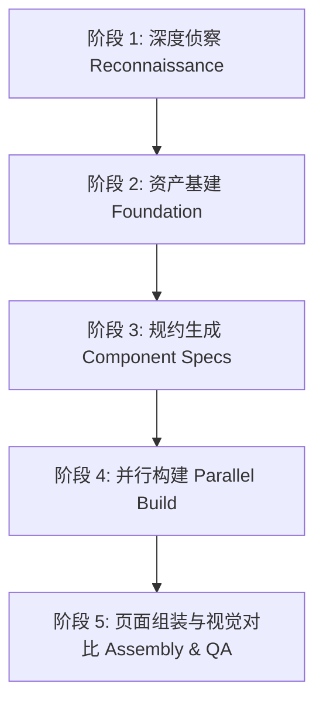

<div align="center">

# AI Website Cloner (ai-clone-web)

### 一键逆向复刻任何网站 · 自动构建现代 Next.js 代码库

给 AI 编码智能体一个网址，全自动深度侦察并复刻为像素级高保真、现代化的 Next.js 16 + Tailwind CSS v4 全栈就绪工程。

**推荐配合 [Claude Code](https://docs.anthropic.com/en/docs/claude-code) / [Cursor](https://cursor.com/) / [OpenAI Codex](https://github.com/openai/codex) / [OpenCode](https://opencode.ai/) / [Antigravity](https://deepmind.google/) 等 AI 编程助手使用。**

[](https://github.com/zhengwuji/ai-clone-web)
[](https://github.com/zhengwuji/ai-clone-web/blob/master/LICENSE)
[](https://nextjs.org/)
[](https://tailwindcss.com/)

[核心功能](#-核心特性) · [使用教程](#-完整使用教程) · [架构规范](#-工程架构与规范) · [更新日志](#-更新日志) · [Docker部署](#-docker-部署)

</div>

---

## 🌟 核心特性

本工程不仅是一个 Next.js 基础模板，更是一套成熟的 **AI Agent 网站逆向工程 SOP 体系**：

- **📁 根目录独立子工程隔离（Standalone Project Isolation）**：每次克隆目标站点时，自动在工作区根目录建立独立的子工程（例如 `projects/<site-name>/`），自包含该站点的组件、素材、数据模型与配置文件，彼此完全解耦，绝不污染模板基座。
- **🛡️ Tailwind CSS v4 构建安全（Turbopack Safe）**：严格遵循 Tailwind v4 静态词法分析规则，严禁在任意类名中拼接动态模板字符串（如 `bg-[url('${VAR}')]`），动态资产与动态计算全面采用内联 `style` 与 CSS 自定义属性，杜绝编译中断与模块未解析报错。
- **⚡ Next.js Image 自动宽高提取与零布局抖动（Zero CLS）**：在无头浏览器侦察阶段自动探测图片的 `naturalWidth` 与 `naturalHeight`，生成组件时优先使用 Next.js 原生 `<Image />` 组件，消除布局漂移（CLS）并规避 ESLint 警告。
- **🧩 强类型数据层解耦架构（Backend & API Ready）**：严禁在 JSX 嵌套层中硬编码海量文案与列表，提取出的内容统一沉淀为 `src/data/` 下具备完整 TypeScript 接口约束的强类型数据模块。前端与数据完全解耦，后续接入真实数据库（Prisma / Supabase / MySQL）或 REST/GraphQL 接口无需重构 UI。
- **🔍 全量 SEO 与社交元数据自动抓取**：自动提取目标站点的 `<title>`、`meta[name="description"]`、OpenGraph 社交卡片（`og:title`、`og:image`、`og:description`）、Twitter Cards、Favicon 及 Canonical 链接，直出 Next.js App Router 标准 `export const metadata: Metadata` 对象。
- **📜 步进式全页滚动与懒加载穿透（Step-Scroll Penetration）**：在页面探测阶段执行自动化步进式自顶向下滚动（Step-Scroll），充分激活 `IntersectionObserver`、虚拟滚动及瀑布流异步加载，杜绝长页面下半部分资产遗漏。
- **🎨 标准类型化 SVG 图标中心**：内置标准化 SVG 图标组件库（`src/components/icons.tsx`），提取出的矢量图标自动转写为具备标准类型提示的 React SVG 组件。
- **🧹 一键缓存与重置指令（`npm run clean`）**：跨平台一键清理 `.next` 缓存、构建垃圾与幽灵路由类型，保证每次构建从最纯净状态出发。

---

## 🛠️ 技术栈

- **前端框架**：Next.js 16 (App Router, Turbopack, React 19, TypeScript strict mode)
- **UI 组件库**：shadcn/ui (Radix primitives, `cn()` 样式组合)
- **样式引擎**：Tailwind CSS v4 (基于 oklch 设计令牌)
- **图标体系**：Lucide React + 自动提取的 React SVG 图标组件库
- **浏览器自动化**：Playwright (支持无头模式页面探测、DOM 计算提取与视觉像素比对)
- **部署就绪**：Vercel、Docker 容器化多阶段构建

---

## 📖 完整使用教程

### 1. 前置准备

- **Node.js**：24+（推荐使用 nvm 管理）
- **AI 编程智能体**：支持读取工作区技能（Skills）的 AI 工具，如 Claude Code、Cursor、OpenAI Codex CLI、Antigravity、OpenCode 等。

### 2. 克隆本仓库并安装依赖

```bash
git clone https://github.com/zhengwuji/ai-clone-web.git
cd ai-clone-web
npm install
npm run check
```

> `npm run check` 会一次性执行 `eslint` 语法检查、`typecheck` 类型校验以及 `next build` 生产编译，确保本地基座 100% 健全。

### 3. 开始克隆目标网站

在你的 AI 编程助手（如 Claude Code / Cursor Composer / Antigravity）中，直接执行 Slash 命令或发出对话指令：

```text
/clone-website https://example.com
```

或者自然语言指令：
```text
请使用 clone-website 技能，帮我克隆 https://example.com，并在根目录创建独立子项目。
```

如需一次性克隆多个页面（例如首页 + 文档页），可同时提供多个 URL：
```text
/clone-website https://example.com https://example.com/docs https://example.com/pricing
```

---

### 4. 了解 AI 的五阶段全自动克隆流水线

当你发出克隆指令后，AI 将严格遵循 `.agents/skills/clone-website/SKILL.md` 的规范执行以下操作：



1. **阶段 1：深度侦察（Reconnaissance）**
   - 自动步进式滚动（Step-Scroll）穿透懒加载；
   - 拍摄桌面端（1440px）与移动端（390px）全高度屏幕截图；
   - 提取全量设计令牌（字体家族、OKLCH 调色板、圆角、阴影、层级）；
   - 抓取全量 SEO 元数据并记录交互行为模式（点击驱动 vs 滚动驱动）。
2. **阶段 2：资产基建（Foundation）**
   - 在根目录下建立独立文件夹（如 `projects/<site-name>/`）；
   - 批量下载图片、多媒体与静态资产到本地 `public/` 目录；
   - 提取内嵌 SVG 图标为 React 组件并配置全局字体。
3. **阶段 3：规约生成（Component Specs）**
   - 拆解页面拓扑（Header、Hero、Features、Testimonials、Footer 等）；
   - 为每个组件编写 `.spec.md` 规范，附带精确的 `getComputedStyle()` 尺寸与多态（默认态、Hover态、展开态）。
4. **阶段 4：并行构建（Parallel Build）**
   - 派发独立 Builder 智能体并行编写 React 组件；
   - 将文案数据统一沉淀为 `src/data/` 强类型模块；
   - 严格遵循 Tailwind v4 安全规范与 Next.js `<Image />` 防抖规范。
5. **阶段 5：组装与视觉质检（Assembly & QA）**
   - 在目标路由中拼装全部区块并绑定数据；
   - 与原站截图逐区块进行像素级比对（Pixel Diff）；
   - 执行 `npm run check` 确保 0 警告、0 类型错误、0 构建失败。

---

## 💻 常用开发指令

| 命令 | 说明 |
| :--- | :--- |
| `npm run dev` | 启动本地 Next.js 开发服务器（默认 http://localhost:3000） |
| `npm run build` | 使用 Turbopack 编译 Next.js 生产版本 |
| `npm run start` | 启动生产编译后的 Next.js 服务 |
| `npm run typecheck` | 执行 TypeScript 全量静态类型检查 (`tsc --noEmit`) |
| `npm run lint` | 执行 ESLint 代码风格与最佳实践检查 |
| `npm run clean` | 跨平台一键清理 `.next` 缓存及临时探测文件 |
| `npm run check` | **推荐**：依次运行 lint + typecheck + build，综合健康检查 |

---

## 🐳 Docker 部署

项目包含完整的开发与多阶段生产 Dockerfile：

```bash
# 启动开发容器环境（端口映射至 3001）
docker compose up dev --build

# 构建并启动轻量化生产容器（端口映射至 3000）
docker compose up app --build
```

---

## 📂 项目结构说明

```
ai-clone-web/
├── .agents/
│   └── skills/
│       └── clone-website/        # 核心：跨智能体通用的全自动克隆 SOP 规约
│           ├── SKILL.md          # 核心执行法则、流水线各阶段规范与反踩坑清单
│           └── references/       # 审计指南与技术检测清单
├── .claude/
│   └── commands/
│       └── clone-website.md      # Claude Code 专用桥接命令
├── docs/
│   ├── design-references/        # 原站截图与视觉对比基准
│   └── research/                 # 提取出的设计令牌、DOM 测量值与组件 Spec
├── projects/                     # 【新增】所有克隆站点独立存放目录（自包含完整子项目）
├── public/                       # 静态资源存放根目录（图片、字体、Favicon）
├── src/
│   ├── app/                      # Next.js App Router 页面与路由
│   ├── components/
│   │   ├── ui/                   # shadcn/ui 原子组件
│   │   └── icons.tsx             # 【新增】统一类型化 SVG 图标中心
│   ├── data/                     # 【新增】解耦的强类型站点数据沉淀目录
│   ├── lib/
│   │   └── utils.ts              # cn() 类名合并工具
│   └── types/                    # 全局 TypeScript 类型契约
├── AGENTS.md                     # 智能体最高宪章（所有 AI 自动优先读取的执行契约）
├── CHANGELOG.md                  # 详细版本变更历史
├── Dockerfile                    # 多阶段生产容器构建脚本
├── package.json                  # 项目依赖与自动化脚本定义
└── README.md                     # 项目完整说明文档
```

---

## 📋 更新日志

详细历史见 [CHANGELOG.md](CHANGELOG.md)。

### [v0.5.1] - 2026-09-25

#### 🚀 核心架构与功能升级
- **独立子工程隔离机制（Standalone Project Isolation）**：
  - 更新了 [AGENTS.md](AGENTS.md) 与 [SKILL.md](.agents/skills/clone-website/SKILL.md)，所有克隆站点默认独立收敛至根目录子项目（`projects/<site-slug>/`），彻底解决以往文件平铺在模板根目录导致的混杂问题。
- **Tailwind CSS v4 构建安全防御**：
  - 明确禁止在类名中拼接动态模板字符串（如 `bg-[url('${VAR}')]`），强制对动态地址使用内联 React `style`，根除 Turbopack `Module not found` 致命编译中断。
- **Next.js Image 自动宽高提取与 CLS 防抖**：
  - 探测流水线增加 `naturalWidth` 与 `naturalHeight` 提取，全面适配 `<Image />` 原生组件，杜绝布局漂移。
- **强类型数据层解耦架构（Backend Ready）**：
  - 强制将页面文案、导航与列表数据抽离为 `src/data/` 强类型模块，彻底从 JSX 表现层剥离，方便日后接入真实数据库与 API 业务。
- **SEO 与社交元数据自动化抓取**：
  - 增加对 `<title>`、Meta 描述、OpenGraph 社交卡片及 Favicon 的全自动提取，直出 App Router `metadata`。
- **步进式全页滚动探测（Step-Scroll）**：
  - 增加自动化步进式滚动，激活全部 `IntersectionObserver` 懒加载请求。
- **基建新增**：
  - 新增标准类型化 SVG 图标中心 [src/components/icons.tsx](src/components/icons.tsx)。
  - 新增一键跨平台缓存重置脚本 `npm run clean`。
- **项目仓库迁移**：
  - 官方仓库地址同步更新为 `https://github.com/zhengwuji/ai-clone-web`。

---

## 📄 开源许可证

本项目基于 [MIT License](LICENSE) 开源。
